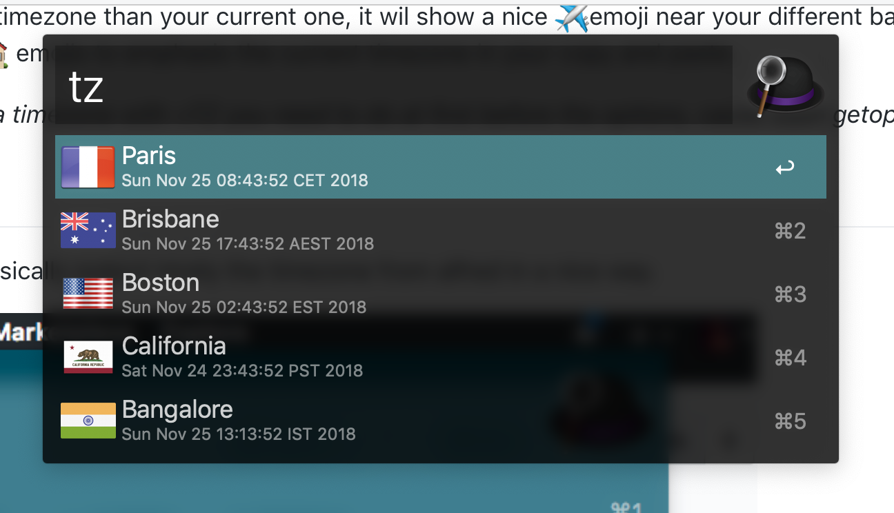

# tzconverter
Show times in different timezone with bash

* Author: Chmouel Boudjnah <chmouel@chmouel.com>
* License: GPL

## Usage
```bash
% tz
% tz 10h30
% tz 10h30 next week
% tz 11:00 next thursday
```

TZ  will show all different timezone for the timeformat

You can as well add multiple timezones directly on the command line like this :
```bash
% tz +America/Chicago +UTC 10h00 tomorrow
```

By default this script will try to detect your current timezone, if you want
to say something like this, show me the different times tomorrow at 10h00 UTC
you can do :

```bash
% tz -t UTC 10
````

*If you want to add extra timezone with +TZ you need to do at first before the
options, cause bash getopt sucks*

## Alfred Support

TZ support alfred, it basically output nicely the timezone from alfred in a nice way.



Just install the [alfredworlflow file](./alfredworkflow/TZ.alfredworkflow) from the repository 
and make sure the tz script is in one of these path: `$HOME/bin/` or `/usr/local/bin/`

## Install

This needs gnu date, on MacOSX just install gnuutils from brew

It needs bash v4 too, you need to install it from brew as well on MacOSX
