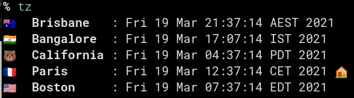

# batzconverter - Batman Timezone Converter

Show times in different timezone with bash

## Blog post

<https://blog.chmouel.com/2021/01/31/batzconverter-a-multiple-timezone-converter/>

## Demo



## INSTALL

grab the shell script directly from this repo and put it in your path, or just copy and paste this :

```bash
#  will try to install in /usr/local if you have the right or $HOME/.local/bin need to be in your path
dest="/usr/local/bin"
[[ -w ${dest} ]] || { dest=${HOME}/.local/bin;mkdir -p ${dest} ;}
curl -f -L -o ${dest}/batz https://raw.githubusercontent.com/chmouel/batzconverter/master/batz.sh && \
        chmod +x ${dest}/batz && \
 echo "'The' batz has been installed into: ${dest}/batz"
```

## Settings

Create a file in `~/.config/batz/config` and add configure the `TIME_ZONES` and
`TIME_ZONES_EMOJI` variable like this :

```shell
## Change the default timezones here!
TIME_ZONES=(
  ["India"]="Asia/Calcutta"
  ["Europe"]="Europe/Paris"
  ["US-East"]="America/New_York"
  ["US-West"]="America/Los_Angeles"
)

TIME_ZONES_EMOJI=(
 ["India"]="🇮🇳 "
 ["Europe"]="🇪🇺 "
 ["US-East"]="🇺🇸 "
 ["US-West"]="🐻"
)

TIME_ZONES_ICONS=(
 ["India"]="/path/to/icons/India.png"
 ["Europe"]="/path/to/icons/Europe.png"
 ["US-East"]="/path/to/icons/US-East.png"
 ["US-West"]="/path/to/icons/US-West.png"
)

DATE_FORMAT="%b %Hh%M"
DATE_FORMAT_PADDING=10
DEFAULT_TIME_ZOME_EMOJI="🌐"
```

The format is :

    "TZ_Alias_Name"="Timezone"

for example :

    "HomeSweetHome"="Europe/Paris"

You can look an example in my config [here](https://gitlab.com/chmouel/rc-config/-/blob/main/batz/config)

you can redefine the location of the config file with the `BATZ_CONFIG_FILE` environment variable.

## Requirement

Some pretty modern Bash >4.0 and modern GNU Date. On MacosX install those from brew (bash and gnuutils).

## Usage

```bash
% batz
% batz 10h30
% batz 10h30 next week
% batz 11:00 next thursday
```

BaTZ  will show all different timezone for the timeformat

You can as well add multiple timezones directly on the command line like this :

```bash
% batz +America/Chicago +UTC 10h00 tomorrow
```

If you don't know the timezone and you have the
[fzf](https://github.com/junegunn/fzf) utility installed you can use the `-f`
option to select interactively the timezone. You can select multiple timezone
by using the `TAB` key in fzf.

By default this script will try to detect your current timezone, if you want
to say something like this:
show me the different times tomorrow if I were at 10h00 AM on UTC timezone, you can do :

```bash
% batz -t UTC 10h00
````

When you set another timezone than your current one, it wil show a nice ✈️emoji
near your different base timezone, or by default it will show a 🏠 emojis to
emphasis the current timezone in your copy and paste.

*If you want to add extra timezone with +TZ you need to do at first before the
options, cause bash getopt is kind of buggy in this regard*

You can use the `-j` option to output as json and may do some parsing with it
(this is used by the Alfred support).

If you have the [gum](https://github.com/charmbracelet/gum) utility installed
you can use the flag `-g` to show the timezone using the gum tables You can as
well set `USE_GUM=1` in your config file to set it as default.

The output looks for example like this for me:


You can add the `-n` argument to batz to not show any colours or emojis. It
will respect the [`NO_COLOUR`](https://no-color.org/) environment variable as
well.

## [Rofi](https://github.com/davatorium/rofi) Support

Take this rofi script [rofibatz.sh](./share/rofibatz.sh) and place it somewhere, i.e: `~/.config/rofi/rofibatz.sh`, launch it up like this :

`rofi -modi batz:${HOME}/.config/rofi/rofibatz.sh -show batz`

You can type batz string i.e: `13h00 tomorrow` when you press enter it will evaluate it.

I have a [custom theme](https://github.com/chmouel/mounch/blob/main/rofi/mounch.rasi) so your mileage may vary but for me it will be shown like this :


## [Wofi](https://hg.sr.ht/~scoopta/wofi) Support


Just do something like this assuming you have wofi and wl-copy installed :

```shell
wl-copy $(batz|sed -e "s/\x1b\[.\{1,5\}m//g"|wofi -d|sed 's/.* : //')
```

will only get you the timezone since wofi doesnt support scripts (afaik)

## [Alfred](https://www.alfredapp.com/) Support

Batz support [alfred](https://www.alfredapp.com/), it basically output nicely the timezone from alfred in a nice way.


Just install the [alfredworlflow file](./alfredworkflow/TZ.alfredworkflow) from the repository
and make sure the batz script is in one of these path: `$HOME/bin/` or `/usr/local/bin/`

To include icons in the Alfred JSON output, configure the `TIME_ZONES_ICONS`
hashmap in your config file (`~/.config/batz/config`):

```bash
TIME_ZONES_ICONS=(
  ["Paris"]="/path/to/icons/Paris.png"
  ["Boston"]="/path/to/icons/Boston.png"
  ["California"]="/path/to/icons/California.png"
)
```

Each timezone that has an entry in `TIME_ZONES_ICONS` will display its
corresponding icon in Alfred. Timezones without an icon entry will be displayed
without an icon.

## Using raffi on Linux

raffi supports as well the json output of batz, you can do something like this to trigger it:

```shell

addons:
  script_filters:
    - name: "Timezone"
      command: "batz.sh"
      args: ["-j"]
      keyword: "tz"
```

## [Zenity](https://help.gnome.org/users/zenity/stable/) support

```shell
output=$(zenity --entry --text "🦇Time" --entry-text $(date ''+%H:%M''));[[ -n $output ]] && batz $output|wl-copy',
```

## Copyright

[Apache-2.0](./LICENSE)

## Authors

Chmouel Boudjnah <[@chmouel](https://twitter.com/chmouel)>
